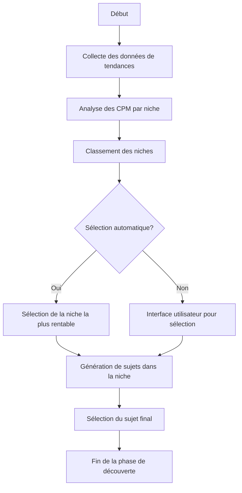
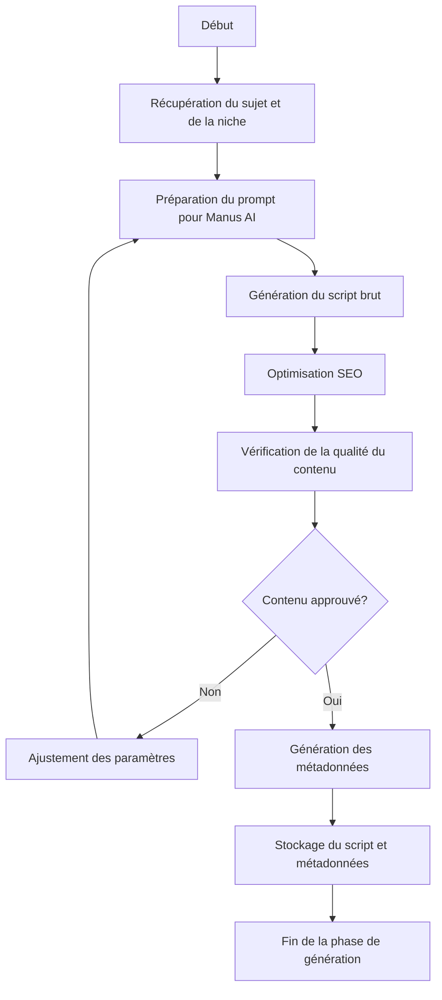
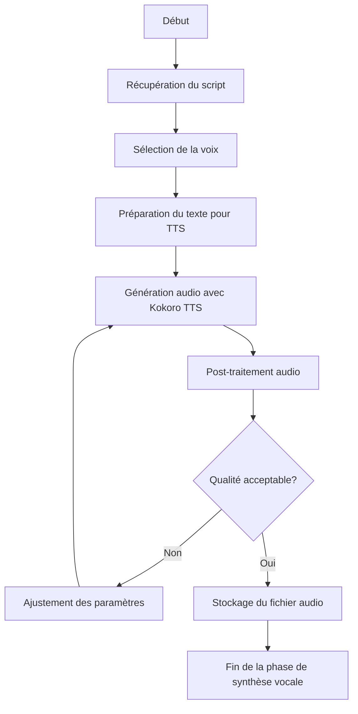
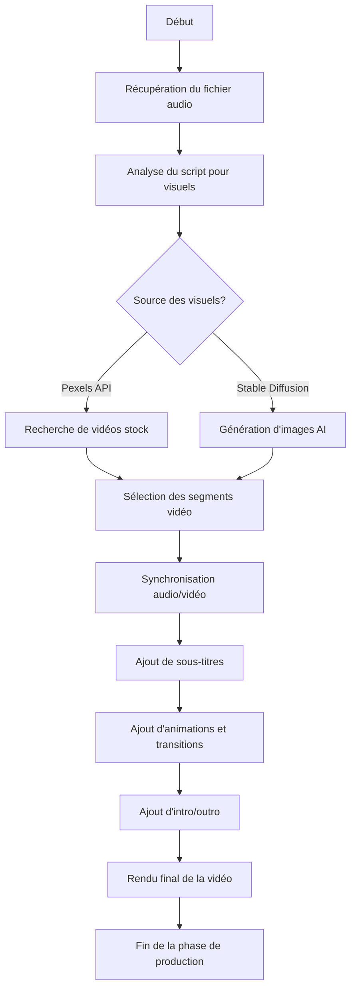
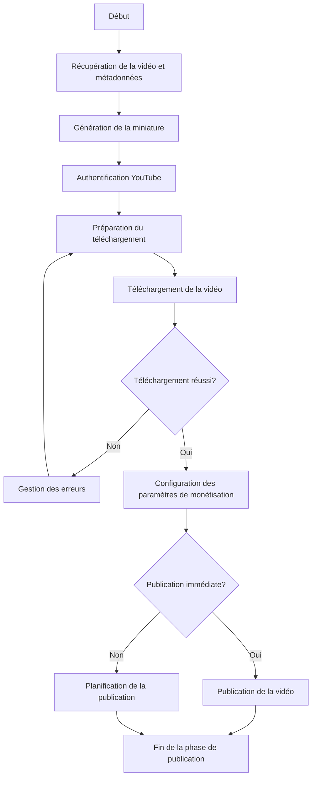
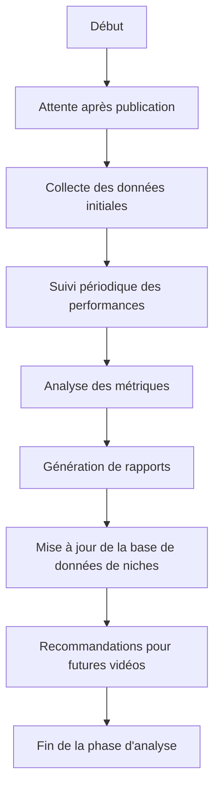
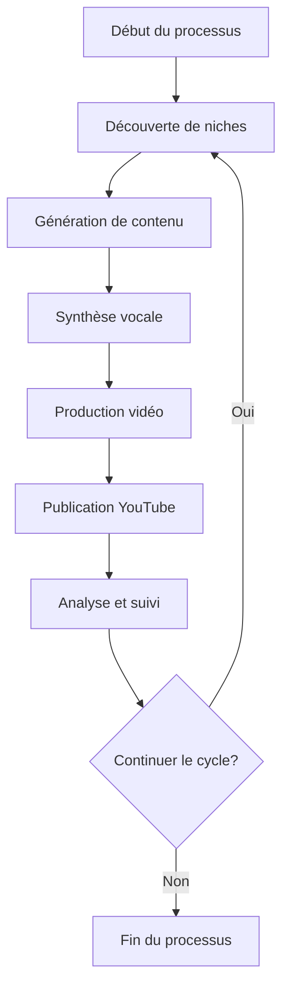

# Flux de travail du système AutoTubeCPM

Ce document décrit le flux de travail détaillé du système AutoTubeCPM, de la découverte des niches à l'analyse des performances.

## 1. Découverte et sélection de niches

## 2. Génération de contenu

## 3. Synthèse vocale

## 4. Production vidéo

## 5. Publication YouTube

## 6. Analyse et suivi

## 7. Flux de travail complet

Ce flux de travail est conçu pour être automatisé tout en permettant des interventions humaines aux points de décision critiques via l'interface utilisateur Streamlit.
